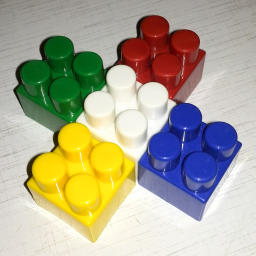
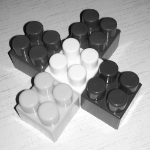
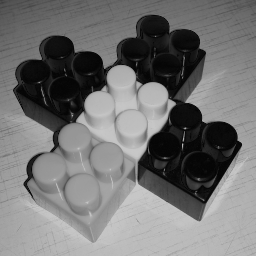
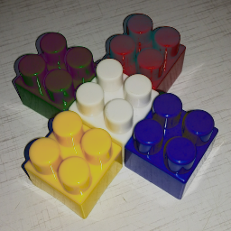
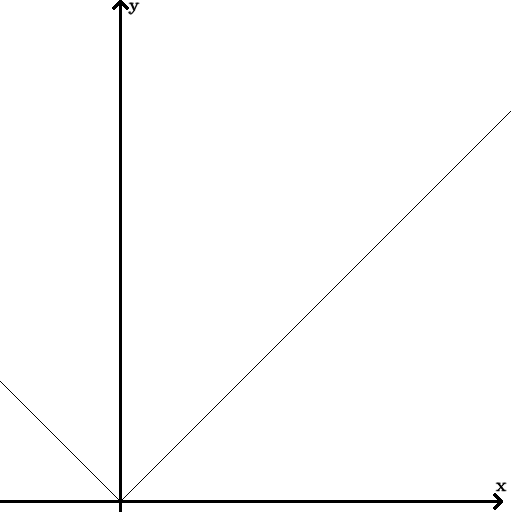

## Работа 3. Яркостные преобразования
автор: Балаев А. А.
дата: 2022-04-11T14:29:02

url: https://github.com/BalaevAA/balaev_a_a

### Задание
1. В качестве тестового использовать изображение data/cross_0256x0256.png
2. Сгенерировать нетривиальную новую функцию преобразования яркости (не стоит использовать слишком простые и слишком простые функции).
3. Сгенерировать визуализацию функцию преобразования яркости в виде изображения размером 512x512, черные точки на белом фоне.
4. Преобразовать пиксели grayscale версии тестового изображения при помощи LUT для сгенерированной функции преобразования.
4. Преобразовать пиксели каждого канала тестового изображения при помощи LUT для сгенерированной функции преобразования.
5. Результы сохранить для вставки в отчет.

### Результаты



Рис. 1. Исходное тестовое изображение



Рис. 2. Тестовое изображение greyscale



Рис. 3. Результат применения функции преобразования яркости для greyscale



Рис. 4. Результат применения функции преобразования яркости для каналов

функция яркостного преобразования: $f(x) = |x - 60| + 5$



Рис. 5. Визуализация функции яркостного преобразования

### Текст программы

```cpp
#include <opencv2/opencv.hpp>
#include <opencv2/imgcodecs.hpp>
#include <cmath>

using namespace cv;


double func(int x) {
	return  abs(x - 60) + 5;
}


int main() {
	std::string img_path = "../data/cross_0256x0256.png";
	cv::Mat img_rgb = cv::imread(img_path);
	cv::Mat img_gre = cv::imread(img_path, cv::IMREAD_GRAYSCALE);

	if (img_rgb.empty() || img_gre.empty()) {
		std::cout << "Could not read the image: " << img_path << std::endl;
		return 1;
	}

	cv::imwrite("lab03_rgb.png", img_rgb);

	cv::imshow("lab03_rgb.png", img_rgb);

	cv::imwrite("lab03_gre.png", img_gre);

	cv::imshow("lab03_gre.png", img_gre);


	cv::Mat lookUpTable(1, 256, CV_8U);
	uchar* p = lookUpTable.ptr();
	for (int i = 0; i < 256; ++i)
		p[i] = func(i);

	cv::Mat img_gre_res;
	cv::LUT(img_gre, lookUpTable, img_gre_res);
	cv::imwrite("lab03_gre_res.png", img_gre_res);

	cv::imshow("lab03_gre_res.png", img_gre_res);

	cv::Mat img_rgb_res;
	cv::LUT(img_rgb, lookUpTable, img_rgb_res);
	cv::imwrite("lab03_rgb_res.png", img_rgb_res);

	cv::imshow("lab03_rgb_res.png", img_rgb_res);

	
	Mat viz_func(512, 512, CV_8UC1, cv::Scalar(255, 255, 255));
	for (int i = 1; i < 256; i++)
	{
		line(
			viz_func,
			Point((i - 1) * 2, 511 - (((int)p[i - 1]) * 2)),
			Point(i * 2, 511 - (((int)p[i]) * 2)),
			0, 1, 0
		);
	}
	arrowedLine(
			viz_func,
			Point(120, 511),
			Point(120, 1),
			Scalar(0,0,0),
			2,
			FILLED, 
			0, 
			0.02 );
	putText(viz_func, "y", cv::Point(128, 10),
		cv::FONT_HERSHEY_COMPLEX_SMALL, 0.8, cv::Scalar(0, 0, 0), 1, cv::LINE_AA);
	arrowedLine(
		viz_func,
		Point(0, 501),
		Point(501, 501),
		Scalar(0, 0, 0),
		2,
		FILLED,
		0,
		0.02);
	putText(viz_func, "x", cv::Point(495, 490),
		cv::FONT_HERSHEY_COMPLEX_SMALL, 0.8, cv::Scalar(0, 0, 0), 1, cv::LINE_AA);
	
	imwrite("lab03_viz_func.png", viz_func);
	imshow("lab03_viz_func.png", viz_func);

	waitKey();
}
```
