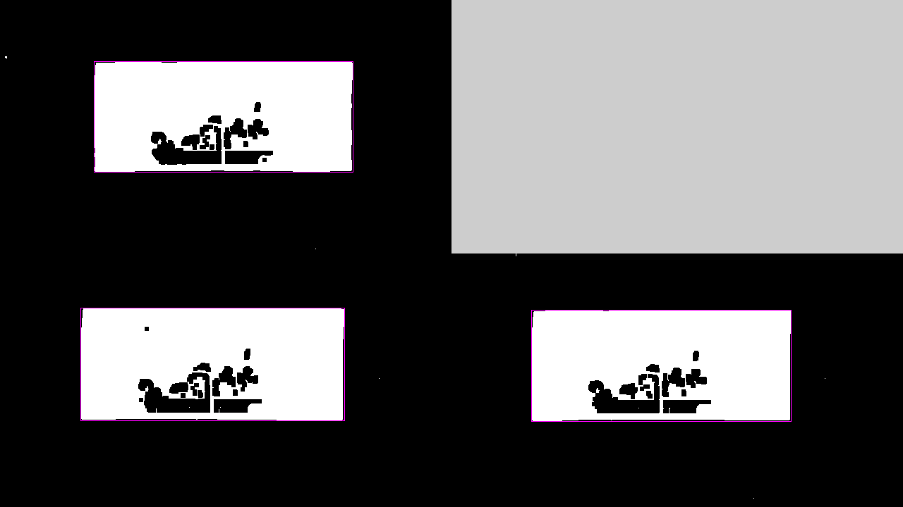
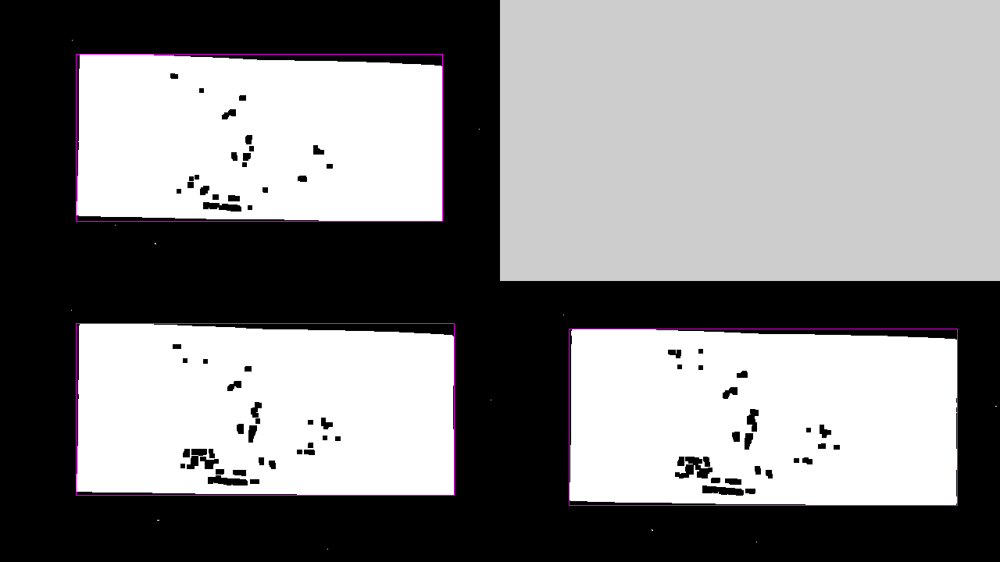

## Работа 4. Детектирование границ документов на кадрах видео
автор: Балаев А.А.
дата: 2022-03-25T15:41:00

### Задание
0. текст, иллюстрации и подписи отчета придумываем самостоятельно
1. самостоятельно снимаем видео смартфоном
- объект съемки - купюры (рубли разного номинала), расправленные и лежащие на поверхности (проективно искаженны прямоугольник)
- количество роликов - от 5 шт.
- длительность - 5-7 сек
- условия съемки разные
2. извлекаем по 3 кадра из каждого ролика (делим кол-во кадров на 5 и берем каждый с индексом 2/5,3/5,4/5)
3. цветоредуцируем изображения
4. бинаризцем изображения
5. морфологически обрабатываем изображения
6. выделяем основную компоненту связности
7. руками изготавливаем маски (идеальная зона купюры)
8. оцениваем качество выделение зоны и анализируем ошибки

### Результаты

### Исходные кадры из каждого ролика


Рис. 1. Кадры со 100 рублевой купюры на темном фоне


Рис. 2. Кадры со 100 рублевой купюры на столе


Рис. 3. Кадры со 200 рублевой купюры на столе


Рис. 4. Кадры со 500 рублевой купюры на белом фоне


Рис. 5. Кадры со 500 рублевой купюры на темном фоне

### Цветоредуцированные изображения


Рис. 1. Цветоредуцированные изображения 100 рублевой купюры на темном фоне


Рис. 2. Цветоредуцированные изображения 100 рублевой купюры на столе


Рис. 3. Цветоредуцированные изображения 200 рублевой купюры на столе


Рис. 4.Цветоредуцированные изображения 500 рублевой купюры на белом фоне


Рис. 5. Цветоредуцированные изображения 500 рублевой купюры на темном фоне

### Бинаризированные изображения


Рис. 1. Бинаризированные изображения 100 рублевой купюры на темном фоне


Рис. 2. Бинаризированные изображения 100 рублевой купюры на столе


Рис. 3. Бинаризированные изображения 200 рублевой купюры на столе


Рис. 4. Бинаризированные изображения 500 рублевой купюры на белом фоне


Рис. 5. Бинаризированные изображения 500 рублевой купюры на темном фоне

### Морфологически обрабатанные изображения


Рис. 1. Морфологически обрабатанные изображения 100 рублевой купюры на темном фоне


Рис. 2. Морфологически обрабатанные изображения 100 рублевой купюры на столе


Рис. 3. Морфологически обрабатанные изображения 200 рублевой купюры на столе


Рис. 4. Морфологически обрабатанные изображения 500 рублевой купюры на белом фоне


Рис. 5. Морфологически обрабатанные изображения 500 рублевой купюры на темном фоне

### Выделенные основные компоненты связности


Рис. 1. Выделенные основные компоненты связности 100 рублевой купюры на темном фоне



Рис. 2. Выделенные основные компоненты связности 100 рублевой купюры на столе


Рис. 3. Выделенные основные компоненты связности 200 рублевой купюры на столе


Рис. 4. Выделенные основные компоненты связности 500 рублевой купюры на белом фоне



Рис. 5. Выделенные основные компоненты связности 500 рублевой купюры на темном фоне


### Текст программы

```cpp
#include <opencv2/opencv.hpp>
#include <string>
#include <iostream>
#include <vector>


std::vector<cv::Mat> selectFramesFromVideo(std::string path, std::string name);
std::vector<cv::Mat> colorConversation(std::vector<cv::Mat> f, std::string name);
std::vector<cv::Mat> tresholdForEveryone(std::vector<cv::Mat> f, std::string name);
std::vector<cv::Mat> morph(std::vector<cv::Mat> f, std::string name);
std::vector<cv::Mat> connnectedComponents(std::vector<cv::Mat> f, std::string name);
cv::Mat makeMosaic(std::vector<cv::Mat> src, std::string name, int type);


std::vector<cv::Mat> selectFramesFromVideo(std::string path, std::string name) {

	cv::VideoCapture cp(path);
	std::vector<cv::Mat> res(3);
	
	int amount_of_frames = cp.get(cv::CAP_PROP_FRAME_COUNT);
	int f1 = (amount_of_frames / 5) * 2,
			f2 = (amount_of_frames / 5) * 3,
			f3 = (amount_of_frames / 5) * 4;
	cv::Mat tmp1, tmp2, tmp3;
	cp.set(cv::CAP_PROP_POS_FRAMES, f1);
	cp >> res[0];
	cv::resize(res[0], res[0], cv::Size(640, 360), cv::INTER_LINEAR);
	cp.set(cv::CAP_PROP_POS_FRAMES, f2);
	cp >> res[1];
	cv::resize(res[1], res[1], cv::Size(640, 360), cv::INTER_LINEAR);
	cp.set(cv::CAP_PROP_POS_FRAMES, f3);
	cp >> res[2];
	cv::resize(res[2], res[2], cv::Size(640, 360), cv::INTER_LINEAR);

	cv::imwrite(name + "_img1.png", res[0]);
	cv::imwrite(name + "_img2.png", res[1]);
	cv::imwrite(name + "_img3.png", res[2]);
	return res;
}


std::vector<cv::Mat> colorConversation(std::vector<cv::Mat> f, std::string name) {
	std::vector<cv::Mat> vec;
	std::cout << "\n\n" << f[0].size() << "\n\n";
	for (int i = 0; i < f.size(); ++i) {
		cv::Mat tmp(640, 360, CV_8UC3);
		cv::cvtColor(f[i], tmp, cv::COLOR_BGR2GRAY);
		cv::imwrite(name + "binary_" + std::to_string(i) + ".png", tmp);
		vec.push_back(tmp);
	}
	return vec;
}

std::vector<cv::Mat> tresholdForEveryone(std::vector<cv::Mat> f, std::string name) {
	int const max_binary_value = 255;
	std::vector<cv::Mat> vec;
	for (int i = 0; i < f.size(); ++i) {
		cv::Mat tmp(640, 360, CV_8UC3);
		cv::threshold(f[i], tmp, 0, max_binary_value, cv::THRESH_BINARY | cv::THRESH_OTSU);
		cv::imwrite(name + "treshold_" + std::to_string(i) + ".png", tmp);
		vec.push_back(tmp);
	}
	return vec;
}

std::vector<cv::Mat> morph(std::vector<cv::Mat> f, std::string name) {
	std::vector<cv::Mat> vec;


	for (int i = 0; i < f.size(); ++i) {
		cv::Mat tmp(640, 360, CV_8UC3);
		cv::Mat k = cv::getStructuringElement(cv::MORPH_RECT, cv::Size(3, 3), cv::Point(-1, -1));
		cv::morphologyEx(f[i], tmp, cv::MORPH_OPEN, k);
		cv::morphologyEx(f[i], tmp, cv::MORPH_CLOSE, k);
		vec.push_back(tmp);
		cv::imwrite( name + "_morph_" + std::to_string(i) + ".png", tmp);
	}

	return vec;
}

std::vector<cv::Mat> connnectedComponents(std::vector<cv::Mat> f, std::string name) {
	std::vector<cv::Mat> vec;
	for (int i = 0; i < f.size(); ++i) {
		cv::Mat labels;
		cv::Mat stats, centroids;
		int num_labels = cv::connectedComponentsWithStats(f[i], labels, stats, centroids, 8, 4);


		std::vector<cv::Vec3b> colors(num_labels);

		for (int i = 0; i < num_labels; ++i) {
			colors[i] = cv::Vec3b(0, 0, 0);
		}

		cv::Mat dst = cv::Mat::zeros(f[i].size(), CV_8UC3);
		int w = f[i].cols;
		int h = f[i].rows;

		for (int row = 0; row < h; ++row) {
			for (int col = 0; col < w; ++col) {
				int label = labels.at<int>(row, col);
				if (label == 0) continue;
				dst.at<cv::Vec3b>(row, col) = colors[label];
			}
		}

		for (int i = 1; i < num_labels; ++i) {
			cv::Vec2d pt = centroids.at<cv::Vec2d>(i, 0);
			int x = stats.at<int>(i, cv::CC_STAT_LEFT);
			int y = stats.at<int>(i, cv::CC_STAT_TOP);
			int width = stats.at<int>(i, cv::CC_STAT_WIDTH);
			int heigth = stats.at<int>(i, cv::CC_STAT_HEIGHT);
			int area = stats.at<int>(i, cv::CC_STAT_AREA);
			std::cout << "area: " << area << " center point " << pt[0] << " " << pt[1] << "\n";
			cv::circle(dst, cv::Point(pt[0], pt[1]), 2, cv::Scalar(0, 0, 255), -1, 8, 0);
			cv::rectangle(dst, cv::Rect(x, y, width, heigth), cv::Scalar(255, 0, 255), 1, 8, 0);
		}
		std::cout << "\n";
		vec.push_back(dst);
		cv::imwrite(name + "con" + std::to_string(i) + ".png", dst);
	}
	return vec;
}

cv::Mat makeMosaic(std::vector<cv::Mat> src, std::string name, int type) {
	cv::Mat res_img(720, 1280, type);
	src[0].copyTo(res_img(cv::Rect(0, 0, 640, 360)));
	src[1].copyTo(res_img(cv::Rect(640, 360, 640, 360)));
	src[2].copyTo(res_img(cv::Rect(0, 360, 640, 360)));

	cv::imwrite("lab04_mosaic_" + name + ".png", res_img);

	return res_img;
}


int main() {

	std::vector<cv::Mat> frames,
		gray_frames,
		bin_frames,
		morph_frames,
		connected_comp;

	cv::Mat mosaic_original, mosaic_gray, mosaic_bin, mosaic_morph, mosaic_comp;

	///////////////////////////////////////////  1  \\\\\\\\\\\\\\\\\\\\\\\\\\\\\\\\\\\\\\\\\\\\\\\\\\\\\\\\
		
	frames = selectFramesFromVideo("../data/rub100(2).mp4", "lab04_rub100_2");
	mosaic_original = makeMosaic(frames, "rub100_2", CV_8UC3);

	gray_frames = colorConversation(frames, "lab04_rub100_2");
	mosaic_gray = makeMosaic(gray_frames, "gray_rub100_2", CV_32S);
	
	bin_frames = tresholdForEveryone(gray_frames, "lab04_rub100_2");
	mosaic_bin = makeMosaic(bin_frames, "bin_rub100_2", CV_32S);

	morph_frames = morph(bin_frames, "lab04_rub100_2");
	mosaic_morph = makeMosaic(morph_frames, "morph_rub100_2", CV_32S);

	connected_comp = connnectedComponents(morph_frames, "lab04_rub100_2");
	mosaic_comp = makeMosaic(connected_comp, "comp_rub100_2", CV_8UC3);

	///////////////////////////////////////////  2  \\\\\\\\\\\\\\\\\\\\\\\\\\\\\\\\\\\\\\\\\\\\\\\\\\\\\\\\

	frames = selectFramesFromVideo("../data/rub200(3).mp4", "lab04_rub200_3");
	mosaic_original = makeMosaic(frames, "rub200_3", CV_8UC3);

	gray_frames = colorConversation(frames, "lab04_rub200_3");
	mosaic_gray = makeMosaic(gray_frames, "gray_rub200_3", CV_32S);

	bin_frames = tresholdForEveryone(gray_frames, "lab04_rub200_3");
	mosaic_bin = makeMosaic(bin_frames, "bin_rub200_3", CV_32S);

	morph_frames = morph(bin_frames, "lab04_rub200_3");
	mosaic_morph = makeMosaic(morph_frames, "morph_rub200_3", CV_32S);

	connnectedComponents(morph_frames, "lab04_rub200_3");
	mosaic_comp = makeMosaic(connected_comp, "comp_rub200_3", CV_8UC3);


	///////////////////////////////////////////  3  \\\\\\\\\\\\\\\\\\\\\\\\\\\\\\\\\\\\\\\\\\\\\\\\\\\\\\\\

	frames = selectFramesFromVideo("../data/rub100(3).mp4", "lab04_rub100_3");
	mosaic_original = makeMosaic(frames, "rub100_3", CV_8UC3);

	gray_frames = colorConversation(frames, "lab04_rub100_3");
	mosaic_gray = makeMosaic(gray_frames, "gray_rub100_3", CV_32S);

	bin_frames = tresholdForEveryone(gray_frames, "lab04_rub100_3");
	mosaic_bin = makeMosaic(bin_frames, "bin_rub100_3", CV_32S);

	morph_frames = morph(bin_frames, "lab04_rub100_3");
	mosaic_morph = makeMosaic(morph_frames, "morph_rub100_3", CV_32S);

	connnectedComponents(morph_frames, "lab04_rub100_3");
	mosaic_comp = makeMosaic(connected_comp, "comp_rub100_3", CV_8UC3);


	///////////////////////////////////////////  4  \\\\\\\\\\\\\\\\\\\\\\\\\\\\\\\\\\\\\\\\\\\\\\\\\\\\\\\\

	frames = selectFramesFromVideo("../data/rub500.mp4", "lab04_rub500");
	mosaic_original = makeMosaic(frames, "rub500", CV_8UC3);

	gray_frames = colorConversation(frames, "lab04_rub500");
	mosaic_gray = makeMosaic(gray_frames, "gray_rub500", CV_32S);

	bin_frames = tresholdForEveryone(gray_frames, "lab04_rub500");
	mosaic_bin = makeMosaic(bin_frames, "bin_rub500", CV_32S);

	morph_frames = morph(bin_frames, "lab04_rub500");
	mosaic_morph = makeMosaic(morph_frames, "morph_rub500", CV_32S);

	connnectedComponents(morph_frames, "lab04_rub500");
	mosaic_comp = makeMosaic(connected_comp, "comp_rub500", CV_8UC3);


	///////////////////////////////////////////  5  \\\\\\\\\\\\\\\\\\\\\\\\\\\\\\\\\\\\\\\\\\\\\\\\\\\\\\\\

	frames = selectFramesFromVideo("../data/rub500(2).mp4", "lab04_rub500_2");
	mosaic_original = makeMosaic(frames, "rub500_2", CV_8UC3);

	gray_frames = colorConversation(frames, "lab04_rub500_2");
	mosaic_gray = makeMosaic(gray_frames, "gray_rub500_2", CV_32S);

	bin_frames = tresholdForEveryone(gray_frames, "lab04_rub500_2");
	mosaic_bin = makeMosaic(bin_frames, "bin_rub500_2", CV_32S);

	morph_frames = morph(bin_frames, "lab04_rub500_2");
	mosaic_morph = makeMosaic(morph_frames, "morph_rub500_2", CV_32S);

	connnectedComponents(morph_frames, "lab04_rub500_2");
	mosaic_comp = makeMosaic(connected_comp, "comp_rub500_2", CV_8UC3);

	cv::waitKey(0);
	return 0;
}
```
