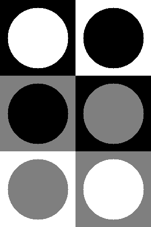
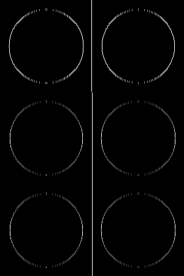
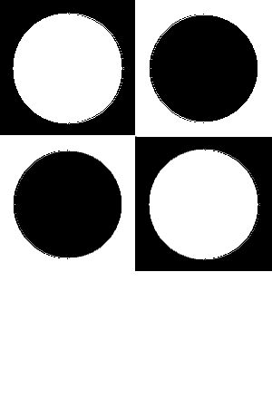
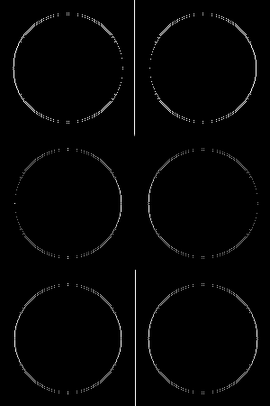

## Работа К. фильтрация изображений
автор: Балаев А. А.
дата: 2022-05-23T13:15:19
хранилище: https://github.com/BalaevAA/balaev_a_a.git

### Задание
0. текст, иллюстрации и подписи отчета придумываем самостоятельно
1. нарисовать
- одноканальное изображение 
- поле 2x3 из квадратных клеток 150x150px черного, белого и серого (127) цвета (соседние цвета разные)
- в цетре клеток - круг другого цвета (все сочетания перебрать)
2. отфильтровать и визуализировать I1 (фильтр вида)
1 -2 1
0 0 0
1 -2 1
3. отфильтровать и визуализировать I2 (фильтр вида)
1 0 1
-2 0 2
1 0 1
4. вычислить и визуалиировать геометрическое среднее (корень из суммы квадратов I1 и I2)

### Результаты

#### Исходное изображение



#### Изображение после применения фильтра I1



#### Изображение после применения фильтра I2



#### Визуализация геометрического среднего



### Текст программы

```cpp
#include <opencv2/opencv.hpp>
#include <vector>


int main() {
	cv::Mat res(450, 300, CV_8UC1);
	cv::Mat rect_black(150, 150, CV_8UC1, cv::Scalar(0, 0, 0));
	cv::Mat rect_white(150, 150, CV_8UC1, cv::Scalar(255, 255, 255));
	cv::Mat rect_gray(150, 150, CV_8UC1, cv::Scalar(127, 127, 127));
	std::vector<cv::Mat> vec = { rect_black, rect_white, rect_gray };
	

	cv::Mat_<float> kernel1(3, 3);
	kernel1 << 1, -2, 1, 0, 0, 0, 1, -2, 1;
	cv::Mat_<float> kernel2(3, 3);
	kernel2 << 1, 0, 1, -2, 0, 2,	1, 0, 1;
	

	int k = -1;
	for (int i = 0; i < 450; i += 150) {
		for (int j = 0; j < 300; j += 150) {
			k = (k + 1) % 3;
			vec[k].copyTo(res(cv::Rect(j, i, 150, 150)));
			cv::circle(res, cv::Point(75 + j, 75 + i), 60,cv::Scalar(100, 0, 1), -1);
		}
	}
	

	cv::Mat filter1;
	cv::filter2D(res, filter1, -1, kernel1, cv::Point(-1, -1));
	cv::Mat filter2;
	cv::filter2D(res, filter2, -1, kernel2, cv::Point(-1, -1));
	
	cv::Mat filter3(450, 300, CV_8UC1);
	for (int i = 0; i < res.rows; i++) {
		for (int j = 0; j < res.cols; j++) {
			filter3.at<uchar>(i, j) = std::sqrt(filter1.at<uchar>(i, j) * filter2.at<uchar>(i, j));
		}
	}

	cv::imshow("img", res);
	cv::imshow("filter_1", filter1);
	cv::imshow("filter_2", filter2);
	cv::imshow("filter_3", filter3);


	cv::imwrite("img.png", res);
	cv::imwrite("filter_1.png", filter1);
	cv::imwrite("filter_2.png", filter2);
	cv::imwrite("filter_3.png", filter3);
	cv::waitKey(0);
	return 0;
}
```
